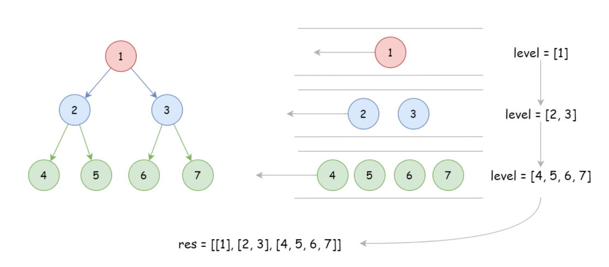

## 分析

## 思路一 bfs
树节点个数为:n
时间复杂度:O(n)
空间复杂度:O(n)

二叉树的层序遍历可以采用 bfs。主要使用队列实现。

广度优先搜索步骤为：
* 初始化队列 q，并将根节点root加入到队列中
* 当队列不为空：
  - 队列中弹出节点node，加入到结果中；
  - 如果node的左子树非空，就把node.left加入队列中。
  - 如果node的右子树非空，就把node.right加入队列中。

由于题目要求每一层保存在一个子数组中，所以我们额外加入了 level 保存每层的遍历结果，
并使用for循环。

  

```python
class Solution:
    def levelOrder(self, root: TreeNode) -> List[List[int]]:
        if not root: return []#必须加这句

        res, q = [], [root]#使用list模拟队列
        #使用队列
        #from collections import deque
        #q = deque()
        q.append(root)
        while q:
            n = len(q)#不加这句也行，把len(q)放到for循环中
            level = []
            #for _ in range(len(q))
            for _ in range(n):
                node = q.pop(0)
                #node = q.popleft()
                level.append(node.val)
                if node.left:
                    q.append(node.left)
                if node.right:
                    q.append(node.right)
            res.append(level)
        return res
```
