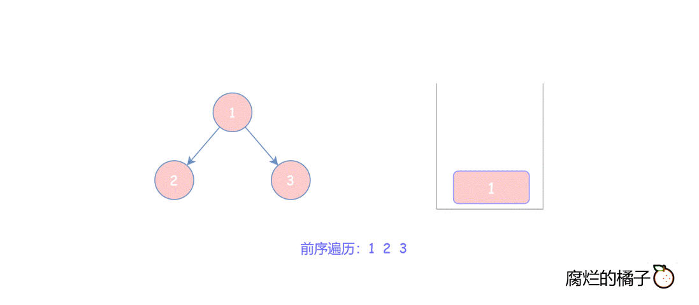
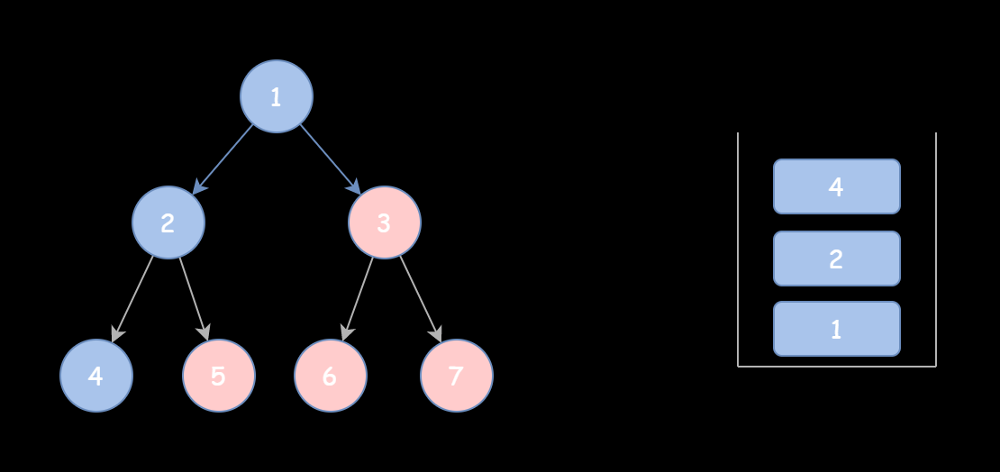

## 分析

### 迭代写法一

  

初始化栈，并将根节点入栈。

如果，栈非空。
> 就弹出栈顶元素 cur，并加入到 res[]中。
> 如果 cur 的右子树非空，则stack.append(cur.right)
> 如果 cur 的左子树非空，则stack.append(cur.left)

想一下，为什么先 入栈右子树，后入栈左子树。

因为，前序是 中左右。

得让右先进入栈，才能先弹出左。

时间复杂度:O(N)
空间复杂度:O(N)
```python
class Solution:
    def preorderTraversal(self, root: TreeNode) -> List[int]:

        if not root: returtn []

        stack = [root]
        res = []

        while stack:
            cur = stack.pop()
            res.append(cur.val)#val!!!

            if cur.right:
                stack.append(cur.right)
            if cur.left:
                stack.append(cur.left)
        
        return res
```

## 迭代写法二

想法是：它先将根节点 cur 和所有的左孩子入栈并加入结果中，直至 cur 为空，用一个 while 循环实现

然后，没弹出一个栈顶元素 tmp, 就访问他的右孩子。再讲这个节点当做 cur 重新调用上边的函数。直到栈为空。
这里又需要一个while循环。

  

时间复杂度:O(N)
空间复杂度:O(N)

```python
class Solution:
    def preorderTraversal(self, root: TreeNode) -> List[int]:

        if not root: return []

        cur, stack, res = root, [], []

        while cur or stack:

            while cur:
                res.append(cur.val)
                stack.append(cur)
                cur = cur.left
            
            tmp = stack.pop()
            cur = tmp.right

        return res
```

## 递归

时间复杂度:O(N)
空间复杂度:O(N)

```python
class Solution:
    def preorderTraversal(self, root: TreeNode) -> List[int]

    res = []

    def dfs(root):

        nonlocal res
        if not root:
            return
        
        res.append(root.val)
        dfs(root.left)
        dfs(root.right)
    
    dfs(root)
    return res
```

