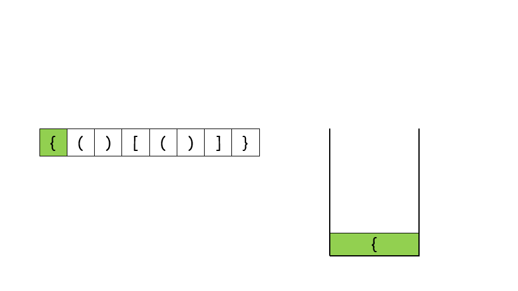

## 分析

使用栈

## 解法一

空间复杂度：O(N)
时间复杂度: O(N)

主要的想法是，( 后边 一定是 ),如果出现 ] } ，就会匹配失败。

如果把 ( [ { 称为1类 

       ) ] }称其2类

则，一旦出现2类符号，在栈顶元素不是对应的1类符号，就会匹配失败。

  

```python
class Solution:
    def isValid(self, s: str) -> bool:

        #假设 s = '{ () [()] }'
        #使用 栈 & 字典

        #注意这里的字典 是 反着来的 也就是 键 是 ')' 值是 '('
        #原因就是 当出现 ')' 时，我们需要寻找有没有 '('
        dic = {')':'(', ']':'[', '{':'}'}
        stack = []

        for i in s:
            if stack and i in dic:
                if dic[i] == stack[-1]: stack.pop()
                else:
                    return False
            else:
                stack.append(i)

        return not stack
```

## 解法二

属于取巧解法

遇到 () [] {} 就替换为空 最后看 s 有没有剩余 如果有 就匹配失败
```python
class Solution:
    def isValid(self, s: str): -> bool:

        while '{}' in s or '[]' in s or '()' in s:
            s = s.replace('{}', '')
            s = s.replace('()', '')
            s = s.replace('[]', '')
        
        return s == ''
```
