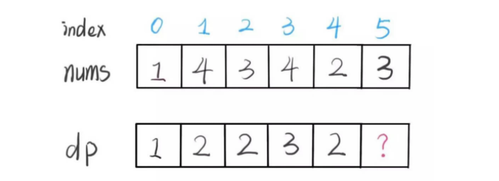

## 分析

## 动态规划
时间复杂度：O(n2)
空间复杂度: O(n)

思路：
这道题给出一个**无序的**整数数组，要找到其中最长的严格递增子序列长度。

可以设dp[i] 是 以nums[i]结尾的 最长递增子序列的长度
那么dp数组就表示的是 以nums[0] 到 nums[-1]结尾的 每个最长递增子序列长度。

所以只要求出了dp数组
```python
max(dp)
``` 
就可以得到结果
  


关键是怎么求dp数组
假设已经知道了dp[01234], 以dp[5]为例
 

想要求出dp[5] 就要考虑nums[01234]中，哪些值比nums[5]小。
把小的那些挑出来，然后依次比较，在dp数组中 加一 的值。哪个最大，取哪个。
代码如下：
```python
for j in range(i):
    if nums[j] < nums[i]:
        dp[i] = max(dp[i], dp[j]+1)
```
接下来，往前思考，dp[01234]的方法其实和dp[5]同理

```python
for i in range(i):
    dp.append(1)
    for j in range(i):
        if nums[j] < nums[i]:
            dp[i] = max(dp[i], dp[j]+1)
```

完整代码如下：
```python
class Solution:
    def lengthofLIS(self, nums: List[int]) -> int:
        if not nums:
            return 0

        dp = []
        for i in range(len(nums)):
            dp.append(1)
            for j in range(i):
                if nums[j] < nums[i]:
                    dp[i] = max(dp[i], dp[j]+1)
        
        return max(dp)
```

## 方法二

时间复杂度:O(nlogn)
空间复杂度:O(n)

参考：
1. [最长上升子序列](https://leetcode-cn.com/problems/longest-increasing-subsequence/solution/zui-chang-shang-sheng-zi-xu-lie-by-leetcode-soluti/)
2. [动态规划 （包含O (N log N) 解法的状态定义以及解释](https://leetcode-cn.com/problems/longest-increasing-subsequence/solution/dong-tai-gui-hua-er-fen-cha-zhao-tan-xin-suan-fa-p/)

```python
class Solution:
    def lengthofLIS(self, nums:List[int]) -> int:
        d = []
        for n in nums:
            if not d or n > d[-1]:
                d.append(n)
            else:
                l, r = 0, len(d)-1
                loc = r
                while l <= r:
                    mid = (l+r) // 2
                    if d[mid] >= n:
                        loc = mid
                        r = mid - 1
                    else:
                        l = mid + 1
                d[loc] = n
        return len(d)
```


## 参考：
1. [动态规划设计方法&&纸牌游戏讲解二分解法](https://leetcode-cn.com/problems/longest-increasing-subsequence/solution/dong-tai-gui-hua-she-ji-fang-fa-zhi-pai-you-xi-jia/)

