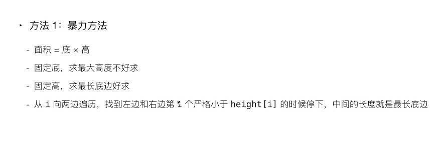

## 分析

## 1. 暴力法

遍历一次数组，在每一个位置向两边扩散。

时间复杂度：O(n2)
空间复杂度：O(1)
  

```python
class Solution:

    def largestRectangleArea(self, heights: List[int]) -> int:

        length = len(heights) #记录当前高度
        max_area = 0 #记录最大面积

        for i in range(lenth):
            hei = heights[i]
            w_l = i #记录最左 
            w_r = i #记录最右

            while i != 0 and hei <= heights[i-1]:
                i -= 1
                w_r = i
            
            while i != length-1 and hei <= heights[i+1]:
                i += 1
                w_l = i
            
            area = hei*(w_l - w_r + 1)
            if area > max_area:
                max_area = area
        return max_area
```
接下来的想法是

## 2. 单调栈+前后哨兵

空间换时间

通过在遍历过程中记录信息，能不能通过一次遍历，不需要中心扩散
就能算出每个高度对应的最大面积。

什么时候出栈：
看到的元素的高度 严格小于 当前栈顶元素的高度的时候
栈顶元素出栈
进而计算出栈顶元素的高度能都勾勒出的矩阵的最大面积

还需要思考的问题是 遇到两个柱子同等高度怎么办。。

时间复杂度：O(n)
空间复杂度：O(n)

```python
class Solution:
    def largestRectangleArea(self, heights: List[int]) -> int:
        heights = [-1] + heights + [-1]  # 给heights两边添加哨兵(heights中有0索引哨兵设置为-1)
        stack = [0]  # 栈中存放heights的索引，索引0代表左边哨兵的索引
        res = 0  # 存放最大矩形面积
        for i in range(1, len(heights)):  # 其中len(heights)-1是最右边哨兵的索引
            s_top = stack[-1]  # 取栈顶索引，先别pop，还不到时候
            while heights[i] < heights[s_top]:  # 当前索引处的高度小于栈顶索引处的高度
                l = stack[-2]  # 栈顶的前一个元素是以栈顶索引处的高度为高的矩形的左边界
                w = i - l -1  # i是以栈顶索引处的高度为高的矩形的右边界
                area = w*heights[s_top]
                if area > res:
                    res = area
                stack.pop()  # 以栈顶索引处的高度为高的矩形面积已经计算，所以弹出
                s_top = l  # 计算下一个栈顶为高的矩形(只要当前索引处的高度小与栈顶索引处的高度)
            stack.append(i)  # 栈内没有比当前索引处高度小的了，将当前索引进栈
        return res
    # 栈中存放的索引在heights中所代表的高度是递增的，
    # 栈中所有索引处的高度都小于等于栈顶索引处的高度，也就是说栈顶索引处的矩形的
    # 左边界已经确定了，就是栈顶的前一个索引处的位置
    # 特别注意的是当右哨兵进栈时，栈内除了左哨兵都将出栈
```