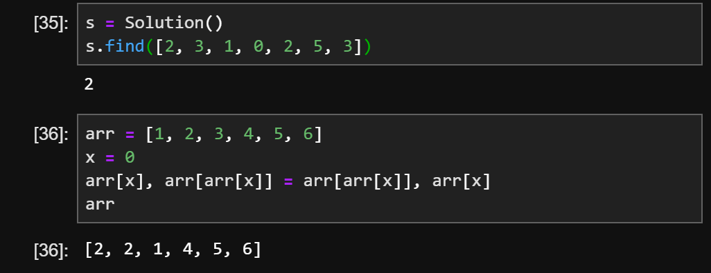

## 分析

## 1. 集合法（未修改数组）

时间复杂度：O(n)
空间复杂度：O(n)

```python
class Solution:
    def findRepeatNumber(self, nums: List[int]) -> int:
        s = set()

        if i in nums:
            if i in s:
                return(i)
                break
            else:
                s.add(i)
```

## 2. 原地哈希（修改数组）

由于数组元素的值都在指定的范围内，这个范围恰好可以与数组的下标一一对应。

因此数字 nums[i] 就应该放在 i 这个位置上。相当于认为编写了哈希函数。而找到重复的数，就相当于
哈希冲突。

时间复杂度：O(n)
空间复杂度：O(1)

```python
class Solution:
    def findRepearNumber(self, nums: List[int]) -> int:
        for i in range(len(nums)):
            while nums[i] != i:
                if nums[i] == nums[nums[i]]:
                    return nums[i]
                else:
                    temp = nums[i]
                    nums[i], nums[temp] = nums[temp], nums[i]
                    #下面这种写法不行
                    #nums[i] , nums[nums[i]] = nums[nums[i]] , nums[i]
```
  

arr[arr[x]], arr[x] = (2, 1)
此时，2赋值给 arr[x], 所以 arr[2] = 1
所以会出现 [2, 2, 1, 4, 5, 6]


## 二分法

时间复杂度：O(nlogn) 二分logn count：O(n)
空间复杂度：O(1)

长度为n+1的数组，所有的数字都在 1~n 的范围内，所以数组中至少有一个数字是重复的。请找出数组中任意一个重复的数字。
但不能修改重复数组。例如{2, 3, 5, 4, 3, 2, 6, 7}中，重复的数字是2或3

```python
class Solution:
    def ff(self, nums):

        start = 1
        end = len(nums) - 1

        #?== end >= start
        while(end > start):
            mid = (start + end) // 2
            counts = self.count(nums, start, mid)
            if counts > mid - start + 1:
                end = mid
            else:
                start = mid + 1
        return start
        #return end

    def count(self, nums, start, end):
        count = 0
        for ele in nums:
            if start <= ele <= end:
                count += 1
            return count
```